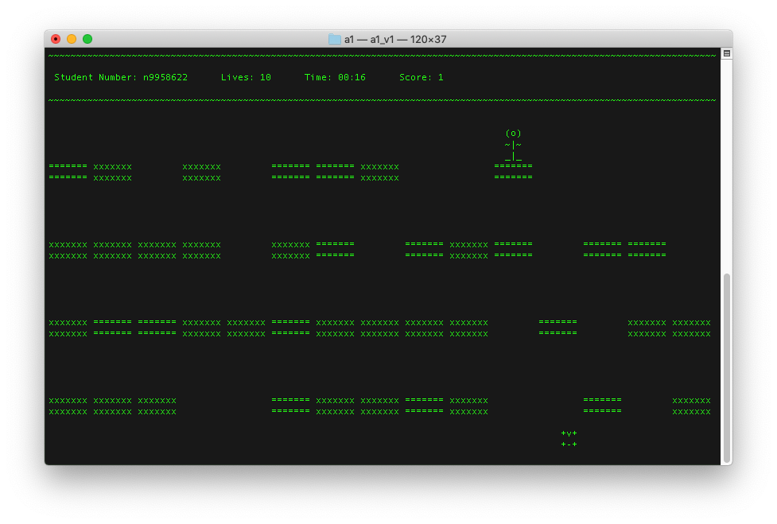
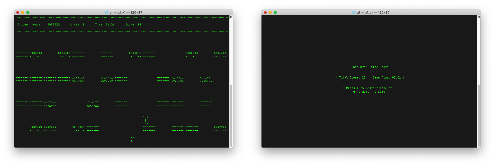

# A Terminal Based C Game (CAB202 Assignment 1)
This terminal program uses a custom QUT graphics library to emulate a player moving along safe and forbidden blocks to score points. Some features include:
- The platforms are randomly constructed based on the current window dimensions and randomise upon player respawn.
- A constant vertical acceleration acts downwards at all time to imitate gravity
- A player receives 1 point per safe block they land on, and loses a life (+ respawns randomly on the top row of safe blocks) when they land on a forbidden block.
- A player gains 2 more lives when the player collides with the animating treasure down the bottom. This treasure moves back and forth along the width of the window while the game is in progress, but stops and starts moving again when the 't' key is pressed.
- A game over screen when all lives are lost showing total score and time. From here, a user can choose to restart the game or exit the program

## Source Code
Unfortunately the source code cannot be released publicly, due to [QUT’s academic policy](http://www.mopp.qut.edu.au/C/C_05_03.jsp#C_05_03.06.mdoc). However, I am happy to provide prospective employers with a unique link to the private repository.

